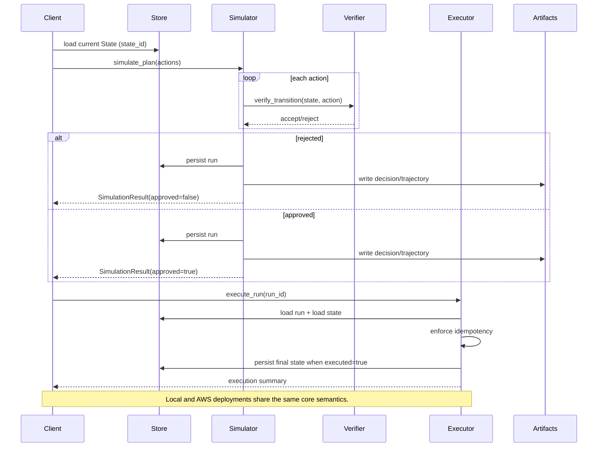

# Beyond Tokens — Builder Lab

Beyond Tokens — Builder Lab is a deployable world-model planning lab with a strict **simulate → verify → commit** flow.

This repository accompanies the **Beyond Tokens** essay series. The essays explain *why*; this repo demonstrates *how*.

https://harveygill.substack.com/p/beyond-tokens

## Staged Versions
- **v1.0 Minimum Viable World Model (local)**
- **v1.1 Executable World Model on AWS**
- **v2 Agent-governed world models (planned)**

## Architecture (Executable World Model)
A minimal world-model pipeline that shares the same core semantics locally and in the cloud.

Artifacts now include `decision.json`, `trajectory.json`, and `deltas.json` for each run.

The planner is provider-neutral and untrusted: it only proposes a plan, while simulation and verification remain authoritative.

## Sequence (Plan → Simulate → Verify → Execute)


AWS mapping: State/Run/Policy stores map to DynamoDB tables. Artifacts live in an S3 prefix, and entry points are Lambda handlers (simulate/execute/status).

Planner insertion (proposes, never executes): Planner → simulate_plan → verify → artifacts → execute_run.

## Setup

```bash
make setup
```

## Lint

```bash
make lint
```

## Tests

```bash
make test
```

## Local Demo

```bash
make demo-local
```

## Local Demo (Planner)

```bash
make demo-local-planner
```

## Optional: Bedrock Planner (v2.1)

The Bedrock planner proposes a plan only; verification remains authoritative.
It cannot bypass simulator/verifier checks.

```bash
ENABLE_BEDROCK_PLANNER=1 AWS_REGION=us-east-1 \
BEDROCK_MODEL_ID=anthropic.claude-3-haiku-20240307-v1:0 \
make demo-local-bedrock
```

**What you should see**
- Scenario A prints two actions using fixture prices and is rejected.
- Scenario B prints two actions using fixture prices and is approved.
- Each scenario prints a non-empty explanation line.
- Artifact paths are printed.

Do not commit environment files; export variables in your shell and keep `.env` files out of git (covered by `.gitignore`).

## AWS Demo

```bash
AWS_PROFILE=beyond-tokens-dev make cdk-synth
AWS_PROFILE=beyond-tokens-dev make cdk-deploy
AWS_PROFILE=beyond-tokens-dev make demo-aws
```

## What you should see
- Scenario A rejects with clear verification errors.
- Scenario B approves and executes with updated state.
- Each scenario prints a short explanation line derived from deterministic verification.

## One-command checks
```bash
make lint
make test
make demo-local
```
