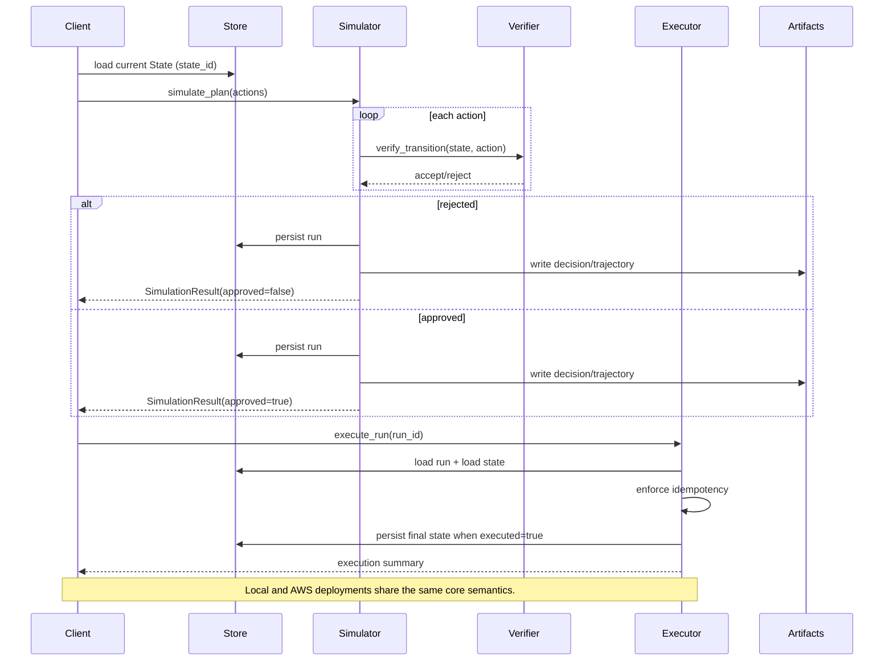

# Beyond Tokens — Builder Lab

Beyond Tokens — Builder Lab is a deployable world-model planning lab with a strict **simulate → verify → commit** flow.

This repository accompanies the **Beyond Tokens** essay series. The essays explain *why*; this repo demonstrates *how*.

## Staged Versions
- **v1.0 Minimum Viable World Model (local)**
- **v1.1 Executable World Model on AWS**
- **v2 Agent-governed world models (planned)**

## Architecture (Executable World Model)
A minimal world-model pipeline that shares the same core semantics locally and in the cloud.
https://harveygill.substack.com/p/beyond-tokens

## Sequence (Plan → Simulate → Verify → Execute)


AWS mapping: State/Run/Policy stores map to DynamoDB tables. Artifacts live in an S3 prefix, and entry points are Lambda handlers (simulate/execute/status).

## Setup

```bash
make setup
```

## Lint

```bash
make lint
```

## Tests

```bash
make test
```

## Local Demo

```bash
make demo-local
```

## AWS Demo

```bash
AWS_PROFILE=beyond-tokens-dev make cdk-synth
AWS_PROFILE=beyond-tokens-dev make cdk-deploy
AWS_PROFILE=beyond-tokens-dev make demo-aws
```

## What you should see
- Scenario A rejects with clear verification errors.
- Scenario B approves and executes with updated state.

## One-command checks
```bash
make lint
make test
make demo-local
```
