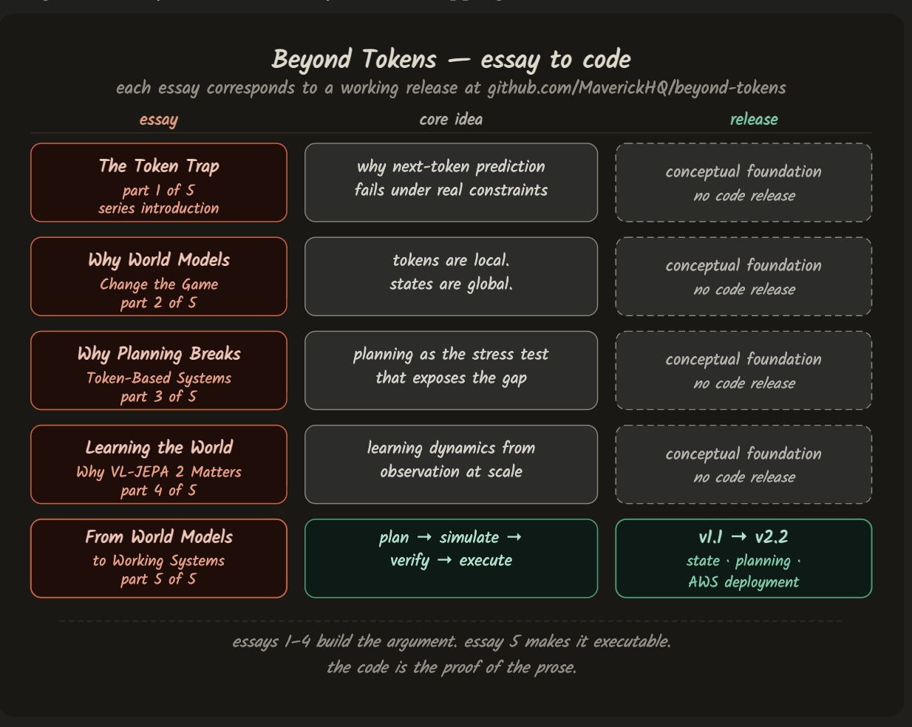

# Beyond Tokens

### Executable world models on AWS — simulate → verify → enforce

This repository accompanies the **[Beyond Tokens](https://harveygill.substack.com/p/beyond-tokens)** essay series published on Substack. It demonstrates a constrained LLM planning architecture: Claude (via AWS Bedrock) proposes action sequences, and a deterministic verifier enforces constraints — accepting or rejecting each plan. Claude cannot bypass verification. That constraint is the architectural point.

The simulate → verify → execute loop is authoritative regardless of what the planner proposes.



---

## What this repository demonstrates

Most AI systems fail not because they are unintelligent, but because they are unaccountable. They generate fluent reasoning without being forced to confront consequences. Plans are proposed but not tested. Actions are taken but not verified. Failures appear only after execution, when rollback is expensive or impossible.

This repository demonstrates a different approach. It implements a minimal but complete architecture in which:

- State is explicit and inspectable
- Actions are simulated before execution
- Constraints are enforced at the level of state transitions
- Execution only occurs after verification passes

The goal is not to build a trading system. The goal is to show — concretely — what it takes to turn world-model theory into executable, verifiable systems that behave correctly under planning pressure.

---

## Architecture

A strict **Plan → Simulate → Verify → Execute** loop. Plans are never executed directly. Every action is simulated against explicit world state, verified against constraints, and only committed if the resulting state is valid. Invalid plans are rejected before execution — no rollback required.

```
Plan → Simulate → Verify → Execute
           ↓
       [invalid] → Reject (no execution, no rollback)
           ↓
       [valid]  → Execute once, idempotently, with auditable trail
```

The planner is provider-neutral and untrusted: it proposes a plan only. Simulation and verification remain authoritative and cannot be bypassed.

AWS mapping: State and Run stores map to DynamoDB tables. Artifacts are written to S3. Entry points are Lambda handlers exposed via API Gateway.

---

## Releases

Each release maps directly to an essay in the Beyond Tokens series. The architecture compounds with each version — it does not pivot.

| Release | What it adds | Essay |
|---|---|---|
| `v1.1` | Explicit state, constraint enforcement, local execution | [From World Models to Working Systems](https://harveygill.substack.com/p/from-world-models-to-working-systems) |
| `v2.0` | Planner integration, upstream proposal mechanism | [Why Planning Breaks Token-Based Systems](https://harveygill.substack.com/p/why-planning-breaks-token-based-systems) |
| `v2.1` | Provider-neutral planners, learned dynamics hook | [Learning the World — Why VL-JEPA 2 Matters](https://harveygill.substack.com/p/learning-the-world) |
| `v2.2` | AWS deployment — same semantics in the cloud | [From World Models to Working Systems](https://harveygill.substack.com/p/from-world-models-to-working-systems) |

---

## Essays

The series builds the argument that leads to this architecture. Each essay is self-contained but they form a single progression.

| Essay | What it argues |
|---|---|
| [The Token Trap](https://harveygill.substack.com/p/beyond-next-token-prediction) | Why next-token prediction fails when reasoning must persist over time |
| [Why World Models Change the Game](https://harveygill.substack.com/p/why-world-models-change-the-game) | Why predicting state rather than tokens changes what systems can do |
| [Why Planning Breaks Token-Based Systems](https://harveygill.substack.com/p/why-planning-breaks-token-based-systems) | Planning as the stress test that exposes architectural limits |
| [Learning the World — Why VL-JEPA 2 Matters](https://harveygill.substack.com/p/learning-the-world) | How world models can be learned from observation rather than hand-built |
| [From World Models to Working Systems](https://harveygill.substack.com/p/from-world-models-to-working-systems) | How these ideas become executable, verifiable systems |

**Recommended entry point for builders:** start with essay 5, then work backwards through the theory as needed.

---

## Setup

```bash
make setup
```

## Lint

```bash
make lint
```

## Tests

```bash
make test
```

---

## Local demo (no credentials required)

```bash
make demo-local
```

## Local demo — with planner

```bash
make demo-local-planner
```

**What you should see**

- Scenario A submits two actions and is rejected — constraints bind before execution
- Scenario B submits two actions and is approved — state transitions are valid
- Each scenario prints a non-empty explanation line derived from deterministic verification
- Artifact paths are printed for `decision.json`, `trajectory.json`, and `deltas.json`

---

## Claude Bedrock Planner (AWS credentials required)

The planner uses Claude (anthropic.claude-3-haiku via AWS Bedrock) to propose plans. Verification remains authoritative — Claude cannot bypass the simulate → verify → enforce constraints. This is the primary architecture demonstrated in this repository.

```bash
ENABLE_BEDROCK_PLANNER=1 AWS_REGION=us-east-1 \
BEDROCK_MODEL_ID=anthropic.claude-3-haiku-20240307-v1:0 \
make demo-local-bedrock
```

---

## AWS demo

```bash
AWS_PROFILE=beyond-tokens-dev make cdk-synth
AWS_PROFILE=beyond-tokens-dev make cdk-deploy
AWS_PROFILE=beyond-tokens-dev make demo-aws
```

## AWS planner demo (v2.2)

```bash
AWS_PROFILE=beyond-tokens-dev make cdk-deploy
AWS_PROFILE=beyond-tokens-dev make demo-aws-planner
AWS_PROFILE=beyond-tokens-dev make smoke-aws-planner
```

**What you should see**

- Scenario A rejects with clear verification errors before any execution occurs
- Scenario B approves and executes with updated state persisted to DynamoDB
- Artifact prefixes are printed — no AWS identifiers in output
- Correlation IDs flow from API response through logs and metrics

Do not commit environment files. Export variables in your shell and keep `.env` files out of git (covered by `.gitignore`).

---

## How to evaluate this repository in 10 minutes

1. Plans are never executed directly
2. Every plan is simulated step-by-step against explicit state
3. Invalid plans are rejected before execution with a deterministic reason
4. Artifacts are produced for every run — `decision.json`, `trajectory.json`, `deltas.json`
5. Execution only occurs after verification passes — idempotently, with an auditable trail

---

## Repository structure

```
services/        Core world model, simulator, verifier, executor
infra/cdk/       AWS infrastructure — API Gateway, Lambda, DynamoDB, S3
examples/        Local and AWS demo scripts
docs/            Architecture diagrams
tests/           Unit and integration tests
scripts/         Setup and utility scripts
openspec/        API specification
```

## Part of the Crucible project
This repository is the first series in a connected body of work. The Crucible project extends this architecture with LLM agents, adversarial quality loops, and autonomous improvement.
- [crucible-ewm](https://github.com/MaverickHQ/crucible-ewm) — observable trajectory infrastructure
